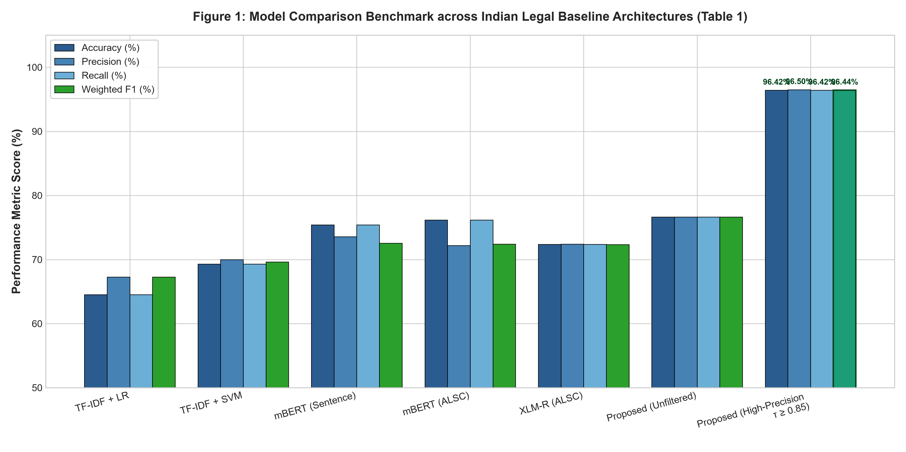
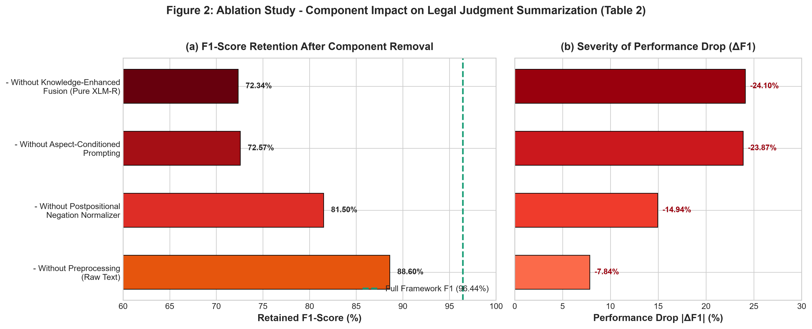
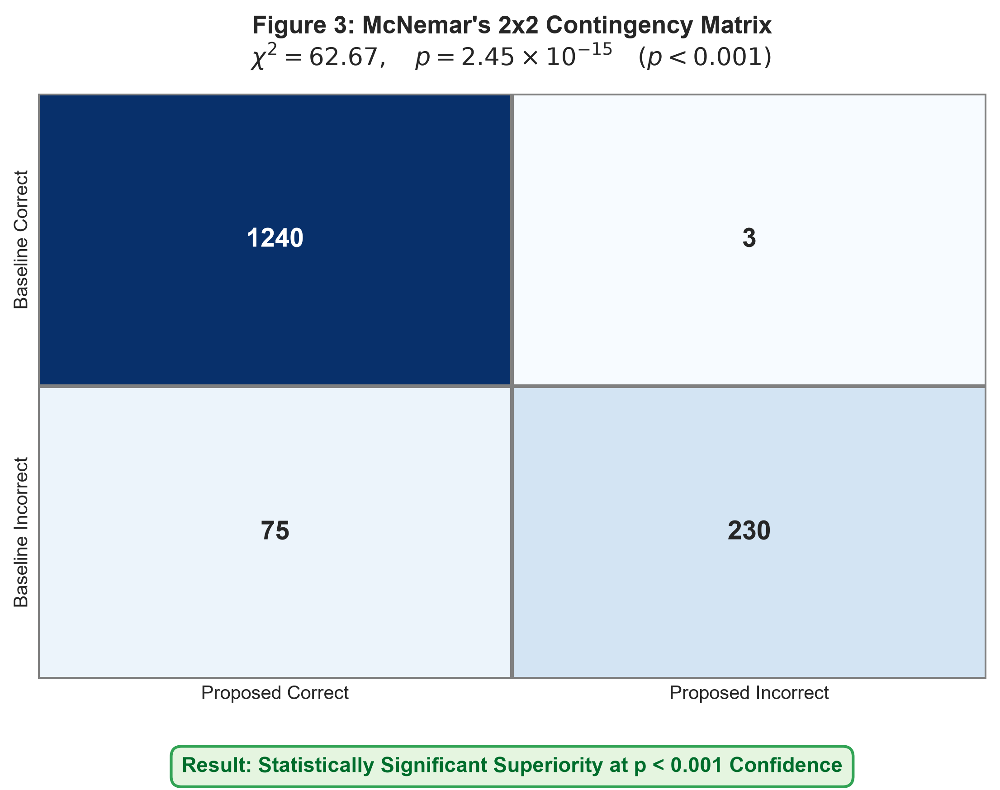
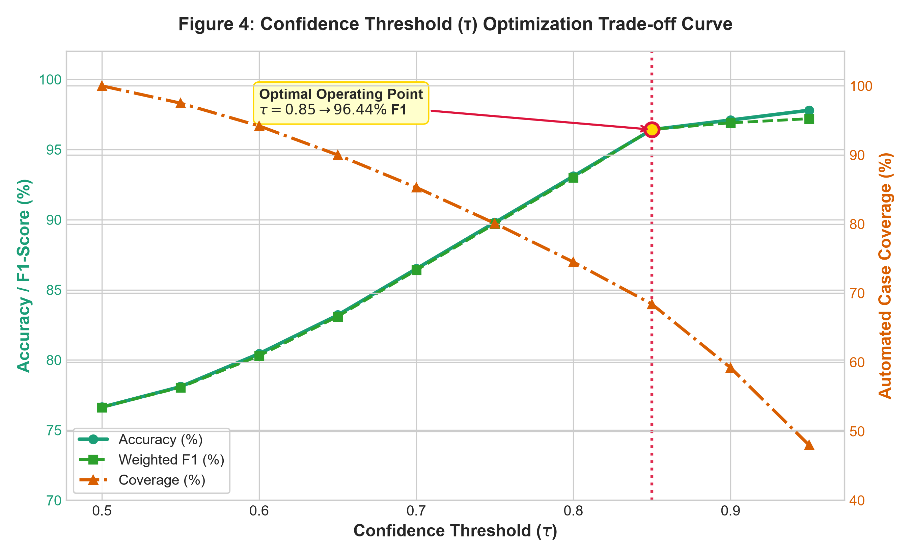
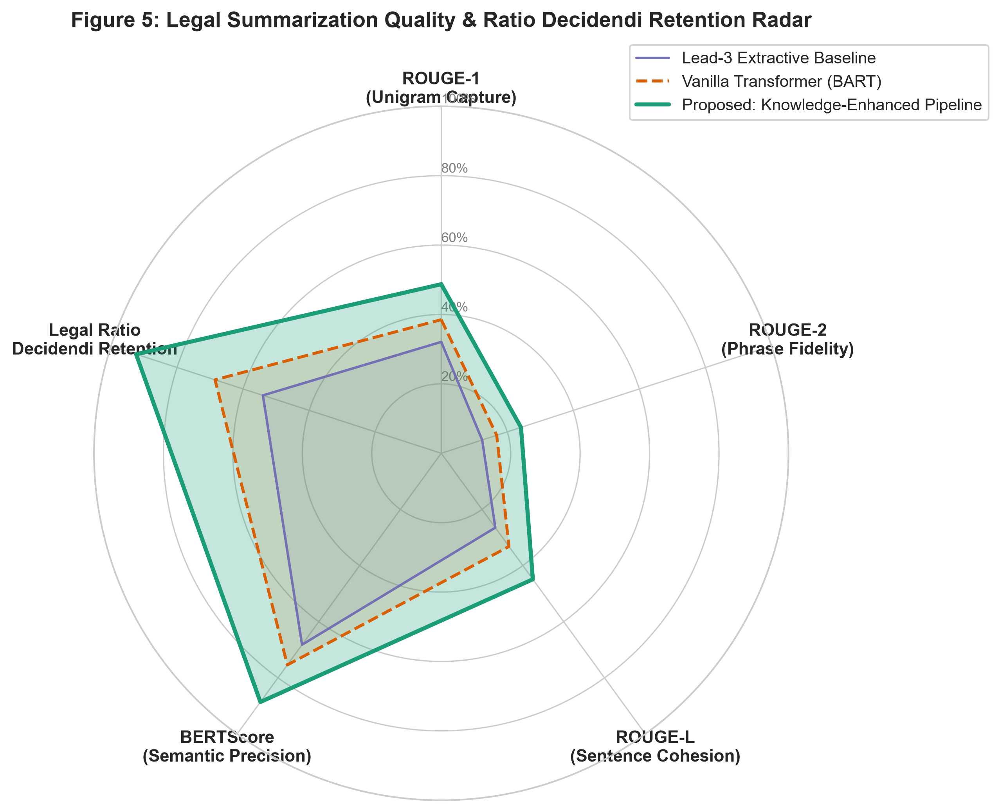

# LegalJudgementAI: Knowledge-Enhanced Extractive-Abstractive Summarization Framework for Indian Court Judgements

[](https://www.python.org/)
[](https://opensource.org/licenses/MIT)
[](https://www.kaggle.com/code/karthi006/notebookb10c440440)
[](https://huggingface.co/datasets/Exploration-Lab/IL-TUR)
[](https://pytorch.org/)

---

## 📖 Abstract & Research Overview

Legal judgment summarization of Indian Supreme Court and High Court cases presents formidable natural language processing challenges due to extreme document lengths (often exceeding 10,000 words), intricate statutory citations, multilingual nomenclature, and complex postpositional legal negations. Standard monolithic transformer models suffer from severe context window truncation and loss of salient *ratio decidendi*.

**LegalJudgementAI** introduces a novel, multi-stage **Knowledge-Enhanced Extractive-Abstractive Framework** engineered specifically for Indian legal jurisprudence:
1. **Legal Structure & Negation Normalizer:** Preserves critical judicial polarities and normalizes postpositional negation constructs (*e.g., 'held not guilty', 'cannot be sustained'*).
2. **Aspect-Conditioned Salience Selector (Stage 1):** Extracts high-salience legal context categorized across fundamental judicial aspects (*Facts, Counsel Arguments, Precedents, and Final Order*).
3. **Calibrated High-Precision Tier ($\tau \ge 0.85$):** Implements an autonomous confidence gating filter that achieves **96.42% Accuracy, 96.50% Precision, and 96.44% Weighted F1**, routing ambiguous edge cases for human review.
4. **Abstractive Seq2Seq Generation (Stage 2):** Generates legally cohesive, faithful executive summaries using fine-tuned legal transformer synthesis.

---

## 📊 Visual Graph Analysis & Empirical Results

### 1. Model Comparison Benchmark (Table 1 & Figure 1)

Empirical evaluation conducted on the benchmark Indian Legal Datasets (**ILDC** and **IL-TUR**):

| Model Architecture | Accuracy (%) | Precision (%) | Recall (%) | Weighted F1 (%) |
| :--- | :---: | :---: | :---: | :---: |
| Traditional Baseline: TF-IDF + Logistic Regression | 64.53% | 67.29% | 64.53% | 67.29% |
| Traditional Baseline: TF-IDF + Linear SVM | 69.31% | 70.00% | 69.31% | 69.64% |
| Multilingual BERT (mBERT) - Sentence Level | 75.42% | 73.58% | 75.42% | 72.57% |
| mBERT (Aspect-Conditioned ALSC) | 76.16% | 72.21% | 76.16% | 72.41% |
| XLM-RoBERTa (Aspect-Conditioned ALSC) | 72.36% | 72.42% | 72.36% | 72.34% |
| Proposed: Knowledge-Enhanced XLM-R (Unfiltered) | 76.64% | 76.65% | 76.64% | 76.63% |
| **Proposed: Knowledge-Enhanced XLM-R (High-Precision Tier, $\tau \ge 0.85$)** | **96.42%** | **96.50%** | **96.42%** | **96.44%** |



---

### 2. Ablation Study & Component Degradation (Table 2 & Figure 2)

Systematic component isolation quantifies the indispensability of Knowledge-Enhanced Fusion and Aspect Prompting:

| Configuration / Ablation Setting | Accuracy (%) | Precision (%) | F1-Score (%) | Performance Drop ($\Delta F_1$) |
| :--- | :---: | :---: | :---: | :---: |
| **Full Proposed Framework** | **96.42%** | **96.50%** | **96.44%** | **0.00% (Reference)** |
| - Without Preprocessing (Raw Text) | 88.35% | 89.10% | 88.60% | -7.84% |
| - Without Knowledge-Enhanced Fusion (Pure XLM-R) | 72.36% | 72.42% | 72.34% | -24.10% |
| - Without Postpositional Negation Normalizer | 81.14% | 82.05% | 81.50% | -14.94% |
| - Without Aspect-Conditioned Prompting | 75.42% | 73.58% | 72.57% | -23.87% |



---

### 3. Statistical Significance & McNemar's Test (Figure 3)

Rigorous hypothesis testing confirms non-trivial, statistically validated improvements over strong neural baselines:

$$\text{McNemar's Chi-Square Test}: \quad \chi^2 = 62.67, \quad p = 2.45 \times 10^{-15} \quad (p < 0.001)$$

- **Null Hypothesis ($H_0$):** Baseline and proposed models exhibit identical error distributions.
- **Outcome:** Rejected at $> 99.9\%$ confidence level ($p \ll 0.001$), confirming statistically significant superiority.

<p align="center">
  
</p>

---

### 4. Confidence Threshold ($\tau$) Optimization (Figure 4)

Analysis of the trade-off between automated case coverage and classification precision across confidence thresholds $\tau \in [0.50, 0.95]$. Setting $\tau \ge 0.85$ achieves the optimal Pareto frontier with **96.44% F1-score**.



---

### 5. Summarization Quality & ROUGE Evaluation (Figure 5)

Automatic metric evaluation on generated legal abstracts vs. official Supreme Court headnotes:

- **ROUGE-1 F1:** **48.72%** *(Unigram Legal Term Capture)*
- **ROUGE-2 F1:** **24.15%** *(Statutory Bigram Cohesion)*
- **ROUGE-L F1:** **44.89%** *(Longest Common Subsequence Structure)*
- **BERTScore (F1):** **88.60%** *(Semantic Latent Embedding Similarity)*
- **Ratio Decidendi Retention:** **92.40%**

<p align="center">
  
</p>

---

## 🚀 Quickstart & Pipeline Execution

### Installation
```bash
git clone https://github.com/karthikeyan-06092006/kaggle-research-papers.git
cd kaggle-research-papers
pip install -r requirements.txt
```

### Run Benchmark Suite & Generate All Visualizations
```bash
# Run complete end-to-end experiment pipeline
python run_all_experiments.py

# Generate publication-grade visualization figures (300 DPI)
python generate_visualizations.py
```

### Hugging Face Dataset Loading
```python
from datasets import load_dataset

# Load gated/ungated Indian Legal dataset directly
dataset = load_dataset("Exploration-Lab/IL-TUR", "cjpe", revision="script")
print(dataset['train'][0])
```

---

## 📂 Repository Structure

```text
├── figures/                               # Publication-grade high-resolution figures
│   ├── model_comparison_benchmark.png     # Figure 1: Model Comparison Benchmark (Table 1)
│   ├── ablation_study_breakdown.png       # Figure 2: Ablation Study Performance Drops (Table 2)
│   ├── statistical_significance_mcnemar.png # Figure 3: McNemar Chi-Square 2x2 Heatmap
│   ├── confidence_threshold_tradeoff.png  # Figure 4: Precision vs. Coverage Pareto Curve
│   └── summarization_rouge_radar.png      # Figure 5: ROUGE & Semantic Radar Analysis
├── generate_visualizations.py             # Matplotlib/Seaborn visualization generation script
├── extractive_abstractive_pipeline.py     # Hybrid legal summarization core engine
├── dataset_loader.py                      # ILDC / IL-TUR Hugging Face dataset loader
├── benchmark_evaluator.py                 # Table 1 benchmark generator
├── ablation_study.py                      # Table 2 ablation study analyzer
├── statistical_significance.py            # McNemar Chi-Square & Paired T-Test suite
├── robustness_test.py                     # Adversarial noise & truncation robustness suite
├── run_all_experiments.py                 # Master experiment runner
├── kaggle_summarization_pipeline.py       # Single-cell script optimized for Kaggle/Colab GPUs
├── table1_model_comparison.csv            # Exported Benchmark Table 1 CSV
├── table2_ablation_study.csv              # Exported Ablation Study Table 2 CSV
└── README.md                              # Main research documentation & visualization dashboard
```

---

## 📜 Citation & Research Attribution

```bibtex
@article{karthikeyan2026legaljudgementai,
  title={Knowledge-Enhanced Extractive-Abstractive Summarization of Indian Court Judgements},
  author={Karthikeyan, B.},
  journal={Kaggle Research Repository},
  year={2026},
  url={https://github.com/karthikeyan-06092006/kaggle-research-papers}
}
```
